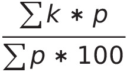
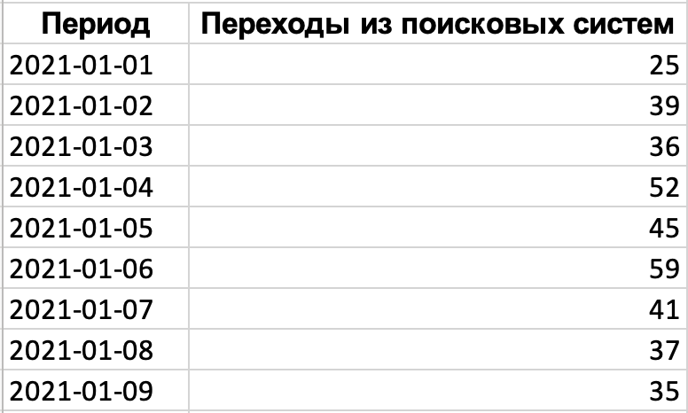
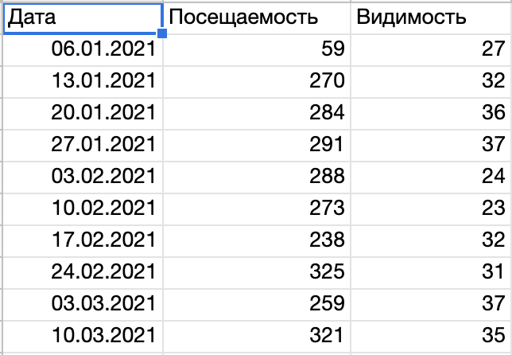
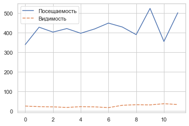

# Посещаемость/Видимость
Задача: определить зависимость количества органического трафика от видимости сайта и каким то образом визуализировать.

## 1.1 Сбор данных
### Видимость
Формула расчета:

*p - частота запроса, k - понижающий коэффициент позиции (от первой до одиннадцатой в органической выдаче на момент запроса)*

Сервис выгружал только позиции по отдельным запросам, поэтому пришлось вручную заполнять общую видимость сайта. Хорошо, что этот показатель снимался всего раз в неделю и это не составило большого труда.

### Посещаемость
Данные я просто выгрузил в виде .xlsx файлы из Яндекс.Метрика предварительно отфильтровав по источнику данных.

### 1.2 Агрегация
Даты и визиты уже были заполнены, поэтому воспользовавшись функцией VLOOKUP я подтянул данные о посещаемости, где значением была дата выгрузки видимости сайта.

### 1.3 Визуализация

Сперва я решил не заморачиваться и просто отрисовать график в Jupyter Notebook.

График мягко говоря оказался не очень информативный.

Поэтому пришлось открывать Tableau.

Недолго повыбирав разные отображения нашел вариант barchart с линейным графиком. Цвета оставил стандартные. Немного добавил правильных описаний для tooltips.

## Выводы

- Времени на все ушло около часа
- Клиент остался доволен
- Ответ мы для себя получили. На самом деле на прямую **ОБЩАЯ** видимость сайта не влияет на количество. 
- В следующий раз я хочу добавить еще фильтрацию по топ10. Вот там может быть уже интереснее.  

*PS Зачем я создал Notebook для меня до сих пор загадка =) Проект будет развиваться дальше, поэтому скорей всего все итерации буду вести в одном проекте*

**DONE!**
